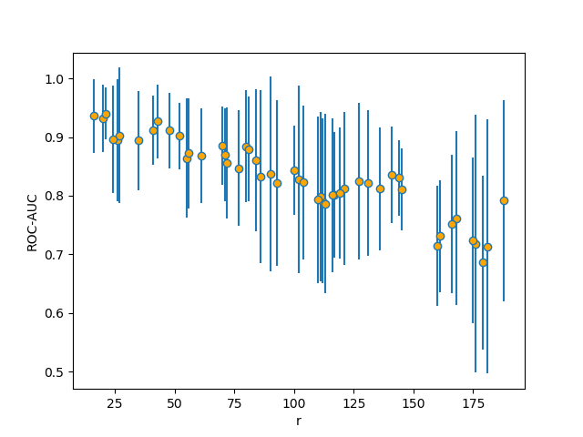

# VIC Validity index 
This repository describes the use and implementati of internal cluster validation by using ensemble supervised classifiers, as reported in [1]. Internal metrics provide a uselful method to evaluate how appropiate is the
division expresed in a class atribbute given or found (cluster), with a finite set of predictors of the clustered instances, without comparing them against an external body of data.

The VIC function works by an ensemble usage of five supervised learning algorithms, ***Linear Discriminant Analysis***, ***Support vector machines***, ***Random Forest***, ***Naive Bayes*** and ***Bayesian Networks***. Those algorithms are implemented using the library *scikit-learn* in python. 
K fold cross-validation is used to , defining the parameter **kgroups**determine the best performing algorithm on a partition evaluation and its implementation can be threaded using the paramater **n_jobs** in VIC.
An example of application is available.

[1] Rodríguez, J., Medina-Pérez, M. A., Gutierrez-Rodríguez, A. E., Monroy, R., & Terashima-Marín, H. (2018). Cluster validation using an ensemble of supervised classifiers. Knowledge-Based Systems, 145, 134–144. https://doi.org/10.1016/j.knosys.2018.01.010.